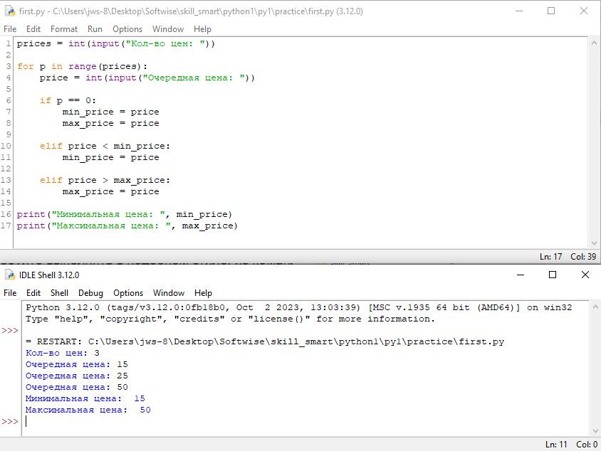
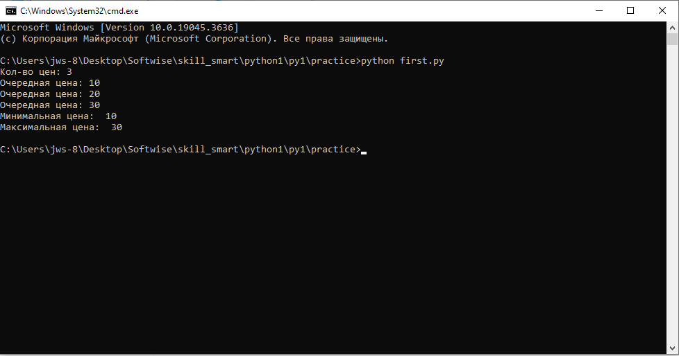
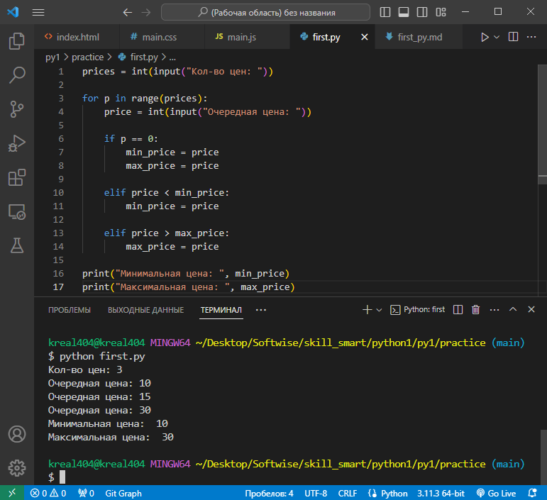

# Практика
Пробую запустить файл с расширением .py разными способами:

1. Запуск через `IDLE Shell 3.12` 
---
2. Запуск через `cmd` 
---
3. Запуск через `vscode` 
---
Больше всего мне нравится 3й способ, т.к. там сразу видны и кодировка и подсветка и простое привычное переключение между директориями.