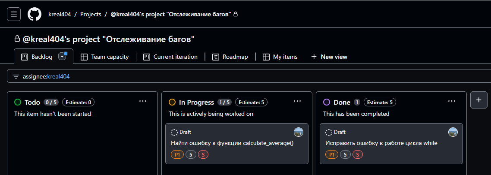
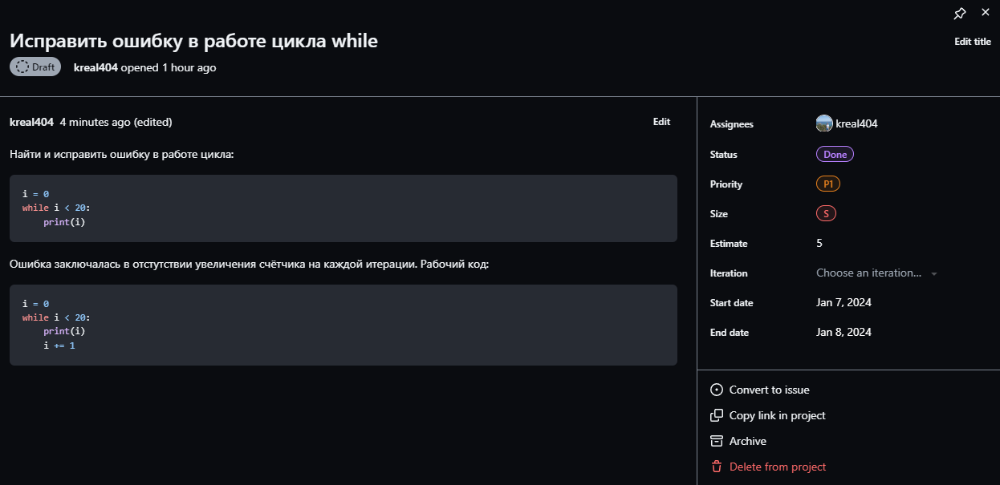
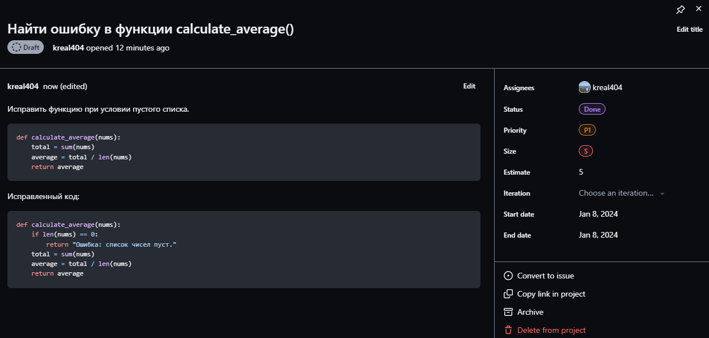

# Практика
Практикуюсь с системой управления проектами/задачами `github.com/features/issues`

1. Доска задач `Backlog` 
---
2. Задача по исправлению бага, связанного с переполнением стека вызовов 
---
3. Баг, связанный с пустым списком 
---
Что-то подобное раньше уже делал по работе только в `trello` и `youtrack`.